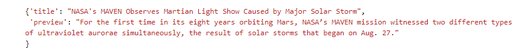
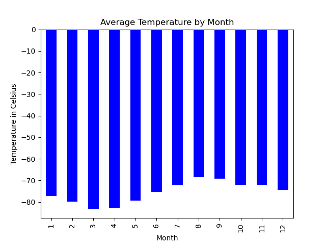
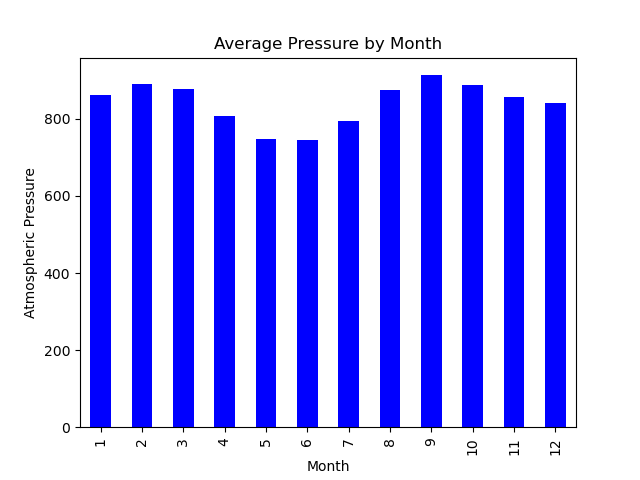
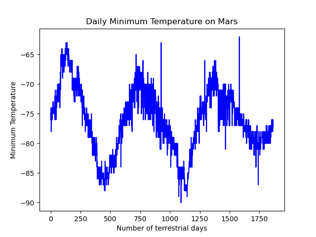

# web_scraping_challenge
Developing a comprehensive web-scraping and data analysis project that involves extracting mars news article information and analyzing mars weather data from a table.

]

## Background
Having acquired the necessary skills in identifying HTML elements, extracting information using automated browsing and HTML parsing, and scraping various data types such as HTML tables and recurring elements like news articles, I am now well-prepared to undertake a comprehensive web-scraping and data analysis project.
Throughout this challenge, I will continue to strengthen my core skills in  collecting data, organizing and storing data, analyzing data, and then visually communicating my insights.

### What I'm Creating
This challenge consists of two technical products.
- Deliverable 1: Scrape titles and preview text from Mars news articles.
- Deliverable 2: Scrape and analyze Mars weather data, which exists in a table.

### Instructions
#### Part 1: Scrape Titles and Preview Text from Mars News
I will open the Jupyter Notebook in the file named ***part_1_mars_news.ipynb.***
I will work on this code as I follow the steps below to scrape the Mars News website.

1: I will use automated browsing to visit the Mars news [(https://static.bc-edx.com/data/web/mars_news/index.html)]. Inspect the page to identify which elements to scrape.

**Hint**
To identify which elements to scrape, I want to inspect the page by using Chrome DevTools.

2: I will create a Beautiful Soup object and use it to extract text elements from the website.

3:Extract the titles and preview text of the news articles that I scraped. Store the scraping results in Python data structures as follows:
- I will store each title-and-preview pair in a Python dictionary and, give each dictionary two keys: **title** and **preview**. An example is the following:

 

- Store all the dictionaries in a Python list.
- Print the list in the notebook.

4: I'll store the scraped data in a file (to ease sharing the data with others).To do so, I will export the scraped data to a JSON file.

#### Part 2: Scrape and Analyze Mars Weather Data
I will open the Jupyter Notebook in the file named ***part_2_mars_weather.ipynb.***
I will work on this code as I follow the steps below to scrape and analyze Mars weather data. 

1: I will use automated browsing to visit the Mars Temperature Data Site [(https://static.bc-edx.com/data/web/mars_facts/temperature.html)]. Inspect the page to identify which elements to scrape.

**Hint**
To identify which elements to scrape, I want to inspect the page by using Chrome DevTools to discover whether the table contains usable classes.

2: I will create a Beautiful Soup object and use it to scrape the data in the HTML table. Note that this can also be achieved by using the Pandas **read_html** function. However, I will use Beautiful Soup here to continue sharpening my web scraping skills.

3: I will assemble the scraped data into a Pandas DataFrame. I will make sure that the columns should have the same headings as the table on the website. Here’s an explanation of the column headings:
- **id:** the identification number of a single transmission from the Curiosity rover
- **terrestrial_date:** the date on Earth
- **sol:** the number of elapsed sols (Martian days) since Curiosity landed on Mars
- **ls:** the solar longitude
- **month:** the Martian month
- **min_temp:** the minimum temperature, in Celsius, of a single Martian day (sol)
- **pressure:** The atmospheric pressure at Curiosity's location

4: I will examine the data types that are currently associated with each column. If necessary, I will cast (or convert) the data to the appropriate datetime, int, or float data types.

**Hint**
I can use the Pandas **astype** and **to_datetime** methods to accomplish this task.

5: I will analyze the dataset by using Pandas functions to answer the following questions:
- How many months exist on Mars?
- How many Martian (and not Earth) days worth of data exist in the scraped dataset?
- What are the coldest and the warmest months on Mars (at the location of Curiosity)? To answer this question:
    - I will find the average minimum daily temperature for all of the months.
    - Then I will plot the results as a bar chart.

- Which months have the lowest and the highest atmospheric pressure on Mars? To answer this question:
  - I will find the average daily atmospheric pressure for all the months.
  - I will plot the results as a bar chart.

- About how many terrestrial (Earth) days exist in a Martian year? To answer this question:
  - I will consider how many days elapse on Earth in the time that Mars circles the Sun once.
  - I will visually estimate the result by plotting the daily minimum temperature.

6: I will export the DataFrame to a CSV file.

***References***

The Mars News  is operated by edX Boot Camps LLC.The news article titles, summaries, dates, and images were scraped from NASA's Mars website in November 2022. Images are used according to the JPL Image Use Policy, courtesy NASA/JPL-Caltech. 
